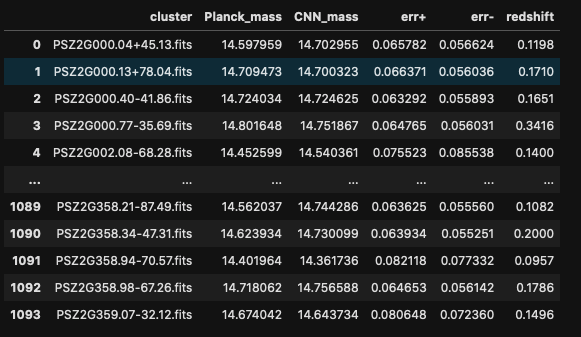

# DeepPlanck
## Dependences 
tensorflow 2.7.0
# Introduction
This repository contains the data product of the project DeepPlanck, i.e. Deep learning mass estimates for Planck PSZ2 clusters. The file containing the estimated masses is DeepPlanck.csv. The file contains 4 columns: cluster, Planck_mass, CNN_mass, uncertainties, and redsfhit. The cluster column corresponds to the name of the cluster in the PSZ2 catalog https://heasarc.gsfc.nasa.gov/W3Browse/all/plancksz2.html. You can read the csv file using, for instance, pandas in Python. 

```
import pandas as pd
pd.read_csv('DeepPlanck.csv')
```

 

IMPORTANT: masses are given as the decimal logarithm of the mass in solar masses.
# Weights
We also provide the trained CNN weights for other applications such us transfer learning.  The clusters masses can be predicted using the module `BaseModel.PredictMass(X,z)`. The notebook `Example.ipynb` explains how to use this module.
